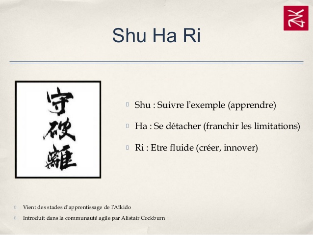
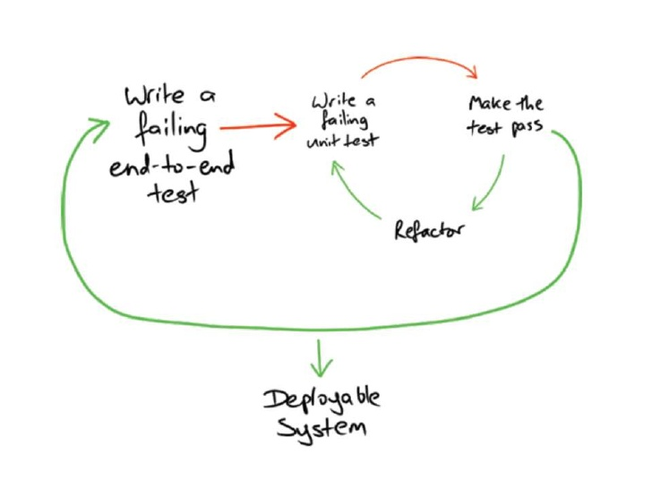

# Test Driven Development

---

## Code Legacy

> **Quizz** ❓ → Qu'appelle-t-on code legacy ?

---

Code Legacy =

1. Code de production
2. Code problématique car :

> 👴 Vieux<sup>1</sup> ? → ❌<br>
> 💩 Moisi<sup>2</sup> ? → ❌<br>
> ~~Tests~~ ? → ✔️<br>

~ **Michael Feathers**, auteur de :<br>
🔗 [Working Effectively with Legacy Code](http://a.co/hxJWYSN)

Notes:

1. Code "hérité" : dans une vieille techno, sans documentation...
2. Code criblé de dettes techniques.

---

## Tests

- Différents types : unitaires, d'intégration, de UI, end to end, manuels
  → cf. [🔗 Pyramide de tests](https://martinfowler.com/bliki/TestPyramid.html)

- Tests d'acceptation :
  - Transverses mais souvent de + haut niveau que les TU
  - Vérifient les règles métier : BDD

Notes:

- Tests d'intégration : concernent plus ou moins de couches :
  - End-to-end : toutes les couches depuis l'UI
  - Sans l'UI
  - Sans la BDD
  - ...
  - Tests de composants : interaction entre quelques objets
- Tests de UI réputés fragiles, car un rien change UI (un décalage d'un pixel suffit parfois à casser un test !).
- Il faut des tests d'intégration :
  - Tous les TU passaient, et pourtant :
. Mais beaucoup moins que de TU. Le nombre décroît et le coût croît plus on monte dans la pyramide des tests. Voir également [Integration Tests Are A Scam](https://www.infoq.com/news/2009/04/jbrains-integration-test-scam) de J.B. Rainsberger _(jbrains)_.

---

## Tests unitaires _(TU)_

- Objectif : tester la plus petite unité de code possible.
- Critères d'un bon TU : **FIRST** → Quezaco ❓

---

### FIRST

- _**F**ast_ → Rapides à exécuter
- _**I**ndependent_ (entre eux)
- _**R**epeatable_ → Indépendants d'un état externe
- _**S**elf-validating_ → statut immédiat : ✔️ ou ❌
- _**T**imely_ → écrits dans un temps rapproché de l'écriture du code de prod correspondant

Notes:

- _Fast_ :
  - On veut un feedback rapide.
  - Des tests non rapides à exécuter sont pénibles à lancer, à maintenir. On finit par les abandonner ou les supprimer.
- _Independent_ :
  - Les tests doivent pouvoir être joués dans n'importe quel ordre.
    → On ne veut pas de couplage temporel entre eux.
  - On veut pouvoir lancer les tests en parallèle (pour avoir un feedback plus rapidement).
  - D'où le problème
- _Repeatable_ :
  - On ne veut pas de tests dont le succès dépend de l'heure, de la date d'exécution, de la machine (celle ayant la bonne licence, la bonne configuration, l'accès à la base de données, ...).
  - Du coup, on ne veut pas de code statique, de singleton, i.e. d'un état global.
  - On veut pouvoir jouer les tests en isolation du reste de l'application et du reste des autres tests.
- _Self-validating_ :
  - Assuré quand on emploie des frameworks de testing dans les conditions habituelles d'utilisation.
  - On ne veut pas devoir déchiffrer un log pour savoir si le test a réussi.
- _Timely_ :
  - On veut avoir le comportement en tête pour écrire le test et/ou le code de production. Sinon, on perd du temps à les retrouver. Donc on les écrit dans la même fenêtre de temps.
  - C'est une discipline à adopter, soit grâce au TDD, soit en cherchant à se rassurer en testant tous les cas, ce qui n'est pas possible ou très fastidieux si fait manuellement.

---

### Les "Trois A"

- Test = 3 phases : _Arrange, Act, Assert_
- Similaire aux étapes [_Given, When, Then_](https://github.com/cucumber/cucumber/wiki/Given-When-Then) de Gerkhin (BDD)
- [4 phases](http://xunitpatterns.com/Four%20Phase%20Test.html) des frameworks xUnit :
  - _Setup_ avant méthode de test et dedans _(Arrange)_
  - _Teardown_ dans et après méthode de test

| xUnit          | 3A      | BDD        | JS                |
|----------------|---------|------------|-------------------|
| Fixture Setup  | ×       | Background | `beforeEach()`    |
| Test Setup     | Arrange | Given      | ×                 |
| Exercise SUT   | Act     | When       | ×                 |
| Verify         | Assert  | Then       | `expect(x).to*()` |
| Teardown       | ×       | ×          | `afterEach()`     |

Notes:

- Pour identifier les 3A dans le code :
  - Les débutants peuvent commencer l'écriture d'une méthode de test avec ce squelette :
    ```java
    @test
    public void monTest() {
      // Arrange
      ...

      // Act
      ...

      // Assert
    }
    ```
- Le setup concerne le sut, ses collaborateurs éventuels et les valeurs attendues. Ces dernières peuvent également être définies inline ou juste avant dans l'Assert correspondant.

Terminologie :

- SUT = System under test = l'objet qu'on teste
- [Gerkhin](https://github.com/cucumber/cucumber/wiki/Gherkin) = Domain Specific Language _(DSL)_ lisible par le métier
  - Pour faire Behavior Driven Development _(BDD)_, Acceptance Test Driven Development _(ATDD)_, Specifications by examples
  - Framework Java : [Cucumber](https://github.com/cucumber/cucumber)
  - Framework .NET : [SpecFlow](http://specflow.org/)

---

### Librairies

Runner / Asserter (fluent is better)

| Langage | Framework                       | Asserter                            | Runner                                               |
|---------|---------------------------------|-------------------------------------|------------------------------------------------------|
| C#      | xUnit, NUnit, MsTest, Fixie     | NFluent, Shoudly, Fluent Assertions | IDE, CI                                              |
| Java    | JUnit                           | AssertJ                             | IDE, CI                                              |
| JS/TS   | ~~QUnit~~, Jasmine, Mocha, Jest | <br><br>Mocha BDD                   | Browsers: Karma; Node: Mocha, Jest; <br>Reporters... |

Notes:

- Les librairies d'assertion ont souvent une API Fluent, afin que le code se lise comme de l'anglais.

---

### Bonnes pratiques pour écrire les tests

- Le nom des méthodes de test doivent être des phrases.
- Règle "Single assertion"
- Clean code : naming, small functions, no comment, ...
- Complexité cyclomatique = 1 → ~~`if`~~
- [Balance DAMP / DRY](https://stackoverflow.com/questions/6453235/what-does-damp-not-dry-mean-when-talking-about-unit-tests) : lisibilité / "duplications" → KISS

Notes:

- DRY: Don't repeat yourself → vs smell "duplication"
- DAMP: Descriptive And Meaningful Phrases → lisibilité du code
- KISS : Keep it simple, ~~stupid~~ smart / short
- Single assertion:
  - Assertion fonctionnelle
  - Si la méthode testée modifie plusieurs propriétés, on aura autant d'`assert`.
    <br>→ Moins elle fait de choses, plus c'est facile.
    <br>> "Do One Thing".

---

### Étapes d’écriture d’un test (C#/Java)

```cs
class MyClassShould // (1)
{
  // SetUp ... (6)

  void Do_Something_Given_The_Context() // (2)
  {
    // Arrange, Given ... (5)
    // Act,     When  ... (4)
    // Assert,  Then  ... (3)
  }

  // TearDown ... (7)
}
```

En JS : `describe('X', …it('should do xxx given yyy'…`

Notes:

- Nommage : au lieu de `MyClassTests.Should_Do_xxx()`, on peut abréger en `MyClassShould.Do_xxx()`.
- L'ordre de ces étapes permettent de générer un maximum de code avec l'IDE.

---

## TDD

- Tests écrits (juste) avant le code de production
  - Respecte le T de FIRST _(Timely)_
- TDD adapté aux projets :
  - Agiles : itératifs ; délais courts entre démo, entre livraisons
  - _Green Field_ 👨‍🌾 : from scratch, sans legacy
  - _Brown Field_ 🌴 : \+ compliqués mais faisables

---

### TDD = Discipline = Règles

> Mantra "❌ Red, ✔️ Green, ♻️ Refactor"


---

Bien situer le type de code de chaque phase :

| Phase       | Type de code |
|-------------|--------------|
| ❌ Red      | Tests        |
| ✔️ Green    | Code de prod |
| ♻️ Refactor | Code de prod |

---

### 3 lois d'Oncle Bob

→ Précisent le mantra du TDD :

> 1. You can't write any production code until you have first written a failing unit test.
> 2. You can't write more of a unit test than is sufficient to fail, and not compiling is failing.
> 3. You can't write more production code than is sufficient to pass the currently failing unit test.

Plus de détails : part 2 🎥

Notes:

- Loi 1 : le cycle commence par la phase "Red".
- Loi 2 : la phase "Red" se termine lorsqu'on a écrit un test qui échoue. On n'écrit pas plus de code que cela.
- Loi 3 : la phase "Green" consiste à écrire du code de production pour faire passer le test. On en écrit le minimum possible. Ensuite, on passe en phase "Refactor" ou de nouveau "Red".
- Voir le test passé de Red à Green est la façon dont on teste le test : une fois le test et le code de prod écrit, le job du test est de passer à rouge en cas d'imprévu. Sinon, c'est un faux positif et c'est un trou insidieux dans notre filet de protection.

---



Notes:

- Le TDD s'apprend en suivant le SHU HA RI. Au début (SHU), il faut appliquer ces règles à la lettre. Il n'y a que comme cela qu'on mesure les bénéfices du TDD.
- Voir le test Red est essentiel pour être sûr que le test fait son job.

---

## Aller plus loin (niveau intermédiaire)

---

### Approches concernant les assertions

| Approach       | Verify                        |
|----------------|-------------------------------|
| Functional     | Output / Exception            |
| State-based    | `sut.getState()`              |
| Behavior-based | Interaction SUT/Collaborators |

---

### Collaborateurs : Types

- Dépendances du SUT
  - ❌ ~~Cachées~~ (`new X()`, globals...)
  - ❌ ~~Fournies par setters~~
  - ✔️ Injectées depuis le constructeur
  - ⚠️ Limiter leur nombre (arguments)
- Inputs de la méthode

---

### Collaborateurs : Stratégie de fourniture dans les tests

| Test          | Collaborateurs            | Objets fournis                       |
|---------------|---------------------------|--------------------------------------|
| D’intégration | ∀                         | Vrais objets                         |
| Unitaire      | Dépendances externes, BDD | Doublures de tests                   |
|               | Classes de l'application  | Au choix : vrais objets ou doublures |

---

### "Mocks" : Doublures de test _(Test Doubles)_

| Pattern | Français  | Description                                              |
|---------|-----------|----------------------------------------------------------|
| _Dummy_ | Poupée    | Implémentation la + simple                               |
| _Stub_  | Bouchon   | Renvoie valeurs spécifiques _(Queries)_                  |
| _Spy_   | Espion    | Fournit _Commands/Queries_ vérifiables (nb appels, args) |
| _Fake_  | Faux      | Simule comportements réalistes                           |
| _Mock_  | Simulacre | Couteau suisse → utiliser librairie                      |

Notes:

- La classification est hétérogène dans la littérature. Celle proposée est celle de [Meszaros | xUnit Patterns](http://xunitpatterns.com/Mocks,%20Fakes,%20Stubs%20and%20Dummies.html) reprise dans l'article [Mocks Aren't Stubs](https://martinfowler.com/articles/mocksArentStubs.html) de Martin Fowler.
- "Doublure" : référence au cinéma, ex. _Stunt double_ (cascadeur).
- _Dummy_ : le + simple (cf. crash test dummies, les poupées). Quand on n'en a pas besoin mais nécessaire pour compiler. Typiquement auto généré (depuis une interface). Attention : doit rester fonctionnel : renvoyer une valeur plutôt que `null`.
- _Stub_ : un peu + élaboré, par exemple en mettant une valeur de retour dans le code au lieu du `throw new NotImplementedException`
- _Spy_ : orienté comportement (white box testing), par ex. Proxy pour tester qu'une méthode a été appelée.
- _Fake_ : implémentation fonctionnelle mais pas de prod, par ex. avec in memory DB. Intéressant pour remplacer les dépendances externes (API), les objets "lourds" aux frontières de l'application (BDD, accès réseau, accès disque/IO).
- _Mock_ : le + élaboré, vérifiable, donc coûteux à écrire tout seul => utiliser framework pour les produire. Attention, implique overhead, test ralenti ; cela se sent qd il y a bcp de TU => ralentit feedback loop, au point de parfois ne plus pouvoir faire de TDD !

---

### Création des mocks

À la main (préférable) ou via librairies de Mock :

- C# : [Moq](https://github.com/moq/moq4), [NSubstitute](http://nsubstitute.github.io/), [FakeItEasy](https://fakeiteasy.github.io/)
- Java : [Mockito](http://site.mockito.org/), [EasyMock](http://easymock.org/), [PowerMock](https://github.com/powermock/powermock)
- JS : [Jasmine (Spies)](https://jasmine.github.io/2.0/introduction.html#section-Spies), [Sinon](http://sinonjs.org/), [Jest](https://facebook.github.io/jest/docs/en/manual-mocks.html)

---

### Les écoles de TDD

- Classicist
  - Boston/Detroit school (Uncle Bob, Kent Beck)
  - State verification / Blackbox testing
  - Design émerge _inside out_ / _bottom up_
- Mockist
  - London school (Steve Freeman & Nat Pryce → [GOOS 2009](http://a.co/arvlSxW "Growing Object-Oriented Software, Guided by Tests"), J.B. Rainsberger)
  - Behavior verification / white box testing
  - Design émerge _outside-in_, grâce à la double boucle ATDD/TDD :
    

Notes:

Quand on est rôdé, on marie les 2 approches, en s'adaptant au contexte :

- GUI first → Mockist
- Règles métier → Classicist

---

TODO

Transformation Priority Premise

- https://8thlight.com/blog/uncle-bob/2013/05/27/TheTransformationPriorityPremise.html
  => word wrap kata
- https://en.wikipedia.org/wiki/Transformation_Priority_Premise
- [string calculator](https://handcraftsman.wordpress.com/2010/06/20/bdd-kata-string-calculator/) ?

- Walking skeleton
- Triangulation
- Golden master - Acceptance Tests
- Property based testing (FsCheck...)
- Other tools : AutoFixture (très puissant, attention à ne pas faire n'importe quoi avec), Faker.Net (génère de la données plausibles : vrais prénoms, email), NBuilder (générer datasets, données en masse) => paramétrage random pour sortir un cas de tests non prévus (un vrai négatif) ; débouche sur property based testing, très utilisé dans la prog fonctionnelle.
